# edatoolkit 📊


A robust, **Object-Oriented (OOP)** Python package designed for high-level, automated **Exploratory Data Analysis (EDA)**.

This toolkit encapsulates complex statistical workflows into a modular `EDA` class, enabling **consistent, reproducible, and statistically sound** data exploration pipelines — from raw data inspection through to hypothesis testing and correlation analysis.

---

## 🗺️ Class Overview



---

## 🚀 Key Features

### 🧠 OOP-Driven Design
- Clean, modular class-based architecture
- Stateful: normality decisions and outlier reports persist across method calls
- Easily reusable across projects and ML pipelines

### 🔍 Automated Column Classification

Columns are automatically categorized on initialization:

| Type | Description | Controlled by |
|------|-------------|---------------|
| `cat_cols` | Categorical variables (object, bool, category) | — |
| `num_cols` | Numerical variables | — |
| `num_but_cat` | Numeric columns with low cardinality (treated as categorical) | `cat_th` |
| `cat_but_car` | High-cardinality categorical columns (excluded from cat analysis) | `car_th` |

> `num_but_cat` columns are included in `cat_cols`. `cat_but_car` columns are excluded from both `cat_cols` and `num_cols`. Use `eda.cat_but_car` to inspect them manually.

### 📊 Numerical Analysis
Extended descriptive statistics including percentiles (1%→99%), mean, median, standard deviation, **Coefficient of Variation (CV%)**, skewness, and kurtosis.

### 📈 Distribution & Normality Diagnostics
Each numerical feature includes a combined Q-Q plot, histogram, and boxplot. Normality tests are selected automatically:

- **Shapiro-Wilk** — for `n ≤ 2500`
- **D'Agostino K²** — for `n > 2500`

> ⚠️ Statistical tests and visual plots are both provided. Always validate visually before making a final normality decision.

### 🚨 Smart Outlier Detection
Distribution-aware logic:

- **Normal distribution** → Z-score method
- **Non-normal distribution** → IQR method

Options: detect only, remove outliers, or cap (winsorize) outliers.

### 📊 Categorical Analysis
Value counts with ratios and interactive Plotly bar charts per categorical feature.

### 🎯 Target-Based Statistical Analysis

**Target vs Categorical:**
- Chi-Square test with Cramér's V effect size
- Crosstab heatmaps

**Target vs Numerical** — test selected automatically:

| Condition | Test |
|-----------|------|
| 2 groups, normal, n > 30 | Welch's Independent T-Test |
| 2 groups, otherwise | Mann-Whitney U |
| 3+ groups, normal, n > 30, equal variance | One-Way ANOVA |
| 3+ groups, otherwise | Kruskal-Wallis |

**Numerical target correlations:**
- Pearson (both normal) or Spearman (otherwise)
- Scatter plots with regression line and strength interpretation

### 🔗 Correlation Analysis
Heatmaps using Pearson, Spearman, or Kendall methods.

---

## 🔄 Workflow & Method Order

> ⚠️ **Important:** Some methods require prior steps. Follow this order:

```
1. EDA(df, target_col)          # Initialize — column types auto-classified
2. check_dataframe()            # Overview: head, shape, NA, duplicates
3. descriptive_analysis()       # Extended descriptive stats
4. check_num()                  # Visualize + test normality → returns non-normal list
5. num_summary({...})           # ← REQUIRED before steps 6–8
6. check_outlier(...)           # Outlier detection (uses normality decisions)
7. cat_summary()                # Categorical value counts + charts
8. target_summary_with_cat()    # Target vs categorical analysis
9. target_summary_with_num()    # Target vs numerical analysis
10. correlation_heatmap()       # Correlation matrix
```

If you call `check_outlier()`, `target_summary_with_cat()`, or `target_summary_with_num()` before `num_summary()`, a `RuntimeError` will be raised.

---

## 🚀 Installation

```bash
git clone https://github.com/elvin-aliyev/edatoolkit.git
cd edatoolkit
pip install -e .
```

---

## 📦 Dependencies

| Package | Purpose |
|---------|---------|
| `pandas` | DataFrame operations |
| `numpy` | Numerical computations |
| `plotly` | Interactive visualizations |
| `scipy` | Statistical tests |
| `statsmodels` | Advanced statistical operations |
| `kaleido` | Static image export for Plotly |
| `nbformat` | Notebook rendering support |

```bash
pip install -r requirements.txt
```

---

## 💡 Quick Start

```python
from edatoolkit.toolkit import EDA
import pandas as pd

df = pd.read_csv("data.csv")
eda = EDA(dataframe=df, target_col="target")

# Step 1: General overview
eda.check_dataframe()

# Step 2: Descriptive statistics
eda.descriptive_analysis()

# Step 3: Check distributions & normality
non_normal_cols = eda.check_num()
# Inspect the plots above, then define your final decisions:

# Step 4 (REQUIRED): Define normality decisions
eda.num_summary({
    "age": "Normal",
    "income": "Non-normal"
})

# Step 5: Handle outliers
eda.check_outlier(cap=True)

# Step 6: Categorical analysis
eda.cat_summary()

# Step 7: Target-based analysis
eda.target_summary_with_cat()
eda.target_summary_with_num()

# Step 8: Correlation
eda.correlation_heatmap(method="spearman")
```

---

## ⚙️ Parameters

### `EDA` constructor

| Parameter | Type | Description | Default |
|-----------|------|-------------|---------|
| `dataframe` | `pd.DataFrame` | Input dataset | Required |
| `target_col` | `str` | Target column name | Required |
| `cat_th` | `int` | Numeric → categorical threshold (unique count) | `10` |
| `car_th` | `int` | High-cardinality threshold for categoricals | `20` |
| `alpha` | `float` | Significance level for hypothesis tests | `0.05` |

### `check_num()` / `cat_summary()` / `target_summary_*()` / `correlation_heatmap()`

| Parameter | Type | Description | Default |
|-----------|------|-------------|---------|
| `width_for_graph` | `int` | Plot width in pixels | `1308` or `900` |
| `height_for_graph` | `int` | Plot height in pixels | `500` or `900` |

### `check_outlier()`

| Parameter | Type | Description | Default |
|-----------|------|-------------|---------|
| `iqr_th` | `float` | IQR multiplier for boundary | `1.5` |
| `z_score_th` | `int` | Z-score threshold | `3` |
| `remove` | `bool` | Remove outlier rows | `False` |
| `cap` | `bool` | Cap (winsorize) outliers | `False` |

> `remove` and `cap` cannot both be `True`.

### `num_summary()`

| Parameter | Type | Description |
|-----------|------|-------------|
| `result_dict` | `dict` | `{"col_name": "Normal"}` or `"Non-normal"`. Columns not in dict default to `"Normal"`. |

### `correlation_heatmap()`

| Parameter | Type | Options | Default |
|-----------|------|---------|---------|
| `method` | `str` | `"pearson"`, `"spearman"`, `"kendall"` | `"spearman"` |

---

## ⚠️ Common Errors

| Error | Cause | Fix |
|-------|-------|-----|
| `RuntimeError: Run num_summary() first.` | Called `check_outlier()` or `target_summary_*()` before `num_summary()` | Run `check_num()` then `num_summary({...})` |
| `ValueError: ! num_cols is empty` | No numerical columns found | Check `cat_th` — it may be classifying all numerics as categorical |
| `ValueError: ! cat_cols is empty` | No categorical columns found | Verify dtypes or lower `cat_th` |
| `ValueError: remove and cap cannot both be True` | Both flags set in `check_outlier()` | Use only one of `remove=True` or `cap=True` |

---

## 📁 Project Structure

```text
edatoolkit/
├── assets/
│   └── skeleton.svg          ← class diagram
├── edatoolkit/
│   ├── __init__.py
│   └── toolkit.py            ← main EDA class
├── examples/
│   ├── example1.ipynb
│   └── example2.ipynb
├── setup.py
├── requirements.txt
├── README.md
└── LICENSE
```

---

## 🎯 Design Philosophy

- ✅ Statistical correctness first — automatic test selection with appropriate fallbacks
- ✅ Automation + flexibility — semi-automated with manual override support
- ✅ Visual + analytical validation — never trust a test result without inspecting the plot
- ✅ Reusability — stateful class designed for ML pipeline integration

---


## 📄 License

Licensed under the **MIT License**. See [LICENSE](LICENSE) for details.

---

## 🤝 Contributing

Contributions are welcome! Please fork the repository and submit a pull request. For major changes, open an issue first to discuss what you'd like to change.

---

## ⭐ Support

If you find this project useful, consider giving it a **star ⭐ on GitHub** — it really helps!
